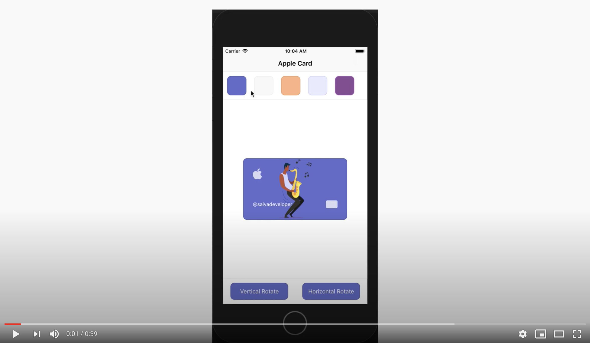

# NativeScript Apple Card - 3D Animation

This source code was created to demonstrate how we can do a 3d horizontal and vertical animation of an Apple Card using only styles. The application built with NativeScript including some .scss styles, custom mixins, font icons, .png images to create an Apple Card using 2 GridLayouts.

## Demo

[](https://www.youtube.com/embed/ybttvqhwmnU)

# If you want a quickstart, clone the repo, then:

```
$ git clone https://github.com/salvadorcoronel/ns-3d-applecard.git
$ cd ns-3d-applecard
$ tns run android/iOS --bundle
```

## Front Apple Card GridLayout


```xml
<GridLayout
  id="frontAppleCard"
  row="1" col="0"
  rows="*,*" columns="2*,1*"
  class="apple-card apple-card-front">
  <Label 
    row="0" col="0"
    class="fa-brands apple-icon" 
    text="&#xf179;"></Label>
  <Label 
    row="1" col="1"
    class="sim-card-icon"></Label>
  <Label 
    row="1" col="0"
    class="name"
    text="@salvadeveloper"></Label>
</GridLayout>
```

## Back Apple Card GridLayout


```xml
<!--Back Apple Card-->
<GridLayout id="backAppleCard" row="1" col="0" rows="4*,1*" columns="*,*" class="apple-card apple-card-back">
  <Label row="0" col="0" textWrap="true" class="name">
    <FormattedString>
      <Span text="Goldman &#xa;"></Span>
      <Span text="Sachs"></Span>
    </FormattedString>
  </Label>
  <Label row="0" col="1" class="fa-brands icon-mastercard" text="&#xf1f1;"></Label>
  <label row="1" col="0" colSpan="2" class="card-bottom"></label>
</GridLayout>
```

## What styles do we need to horizontally rotate Apple Card Layout?

```css
@keyframes flip-h-back {
  0% { transform: rotate3d(0,0,0); }
  49.99% { transform: rotate3d(0,-89.99,0); }
  50.01% { transform: rotate3d(0,-90,0); opacity: 0; } // opacity: 0;
  100% { transform: rotate3d(0,-180,0); }
}

@keyframes flip-h-front {
  0% { transform: rotate3d(0,180,0); }
  49.99% { transform: rotate3d(0,90.01,0); }
  50% { transform: rotate3d(0,90,0); opacity: 1; } // opacity: 1;
  100% { transform: rotate3d(0,0,0); }
}

.flip-h-back {
  @include set-animation(flip-h-back);
}

.flip-h-front {
  opacity: 0;
  @include set-animation(flip-h-front);
}
```

## What styles do we need to vertically rotate Apple Card Layout?

```css
@keyframes flip-v-back {
  0% { transform: rotate3d(0,0,0); }
  49.99% { transform: rotate3d(-89.99,0,0); }
  50% { transform: rotate3d(-90,0,0); opacity: 0; }
  100% { transform: rotate3d(-180,0,0); }
}

@keyframes flip-v-front {
  0% { transform: rotate3d(180,0,0); }
  49.99% { transform: rotate3d(90.1,0,0); }
  50% { transform: rotate3d(90,0,0); opacity: 1; }
  100% { transform: rotate3d(0,0,0); }
}

.flip-v-back {
  @include set-animation(flip-v-back);
}

.flip-v-front {
  opacity: 0;
  @include set-animation(flip-v-front);
}
```

## You can see that we use a "set-animation" mixin, this define the animation that we want to apply.

```css
@mixin set-animation($name) { 
  animation-name: $name;
  animation-delay: 0;
  animation-duration: 0.7s;
  animation-timing-function: ease-in-out;
  animation-fill-mode: forwards;
}
```

## Define Button tap event to horizontally or vertically rotate

```xml
<!--Vertical rotate -->
<Button row="0" col="0"
      (tap)="onRotateCard('v')"
      text="Vertical Rotate"></Button>

<!--Horizontal rotate -->
<Button row="0" col="0"
      (tap)="onRotateCard('h')"
      text="Horizontal Rotate"></Button>
```

## Define a method that return the specific classes to rotate the apple card

### **Example I:** If we want to horizontally rotate the Apple Card 180 degrees, we need to do 2 actions:

- ***First Action***:
Horizontally Rotate the front of the apple card 180 degrees back

```typescript
this.frontAppleCard.className = 'apple-card apple-card-front flip-back-h';
```

- ***Second Action***:
Horizontally Rotate the back of the apple card 180 degrees forward

```typescript
this.backAppleCard.className = 'apple-card apple-card-back flip-front-h';
```

`How you can see only need to apply the specific classes to front or back of the apple card to rotate them.`

### **Example II:** If we want to horizontally rotate the apple card (rotating the card to its original state), we need to do 2 actions to:

- ***First Action***:
Horizontally Rotate the front of the apple card (after the above actions the front of the apple card is in the background) 180 degrees front

```typescript
this.frontAppleCard.className = 'apple-card apple-card-front flip-front-h';
```

- ***Second Action***:
Horizontally Rotate the back (after the above actions the front of the apple card is in the background) of the apple card 180 degrees back

```typescript
this.backAppleCard.className = 'apple-card apple-card-back flip-back-h';
```

below this all code that we need to do 3D flip the apple card both horizontally and vertically...

```typescript
onRotateCard(rotate: string) {
  if (!this.frontCardInteraction) {
    this.animateAppleCard(this.frontAppleCard, this.getRotationStyle('front', 'back', rotate));
    this.animateAppleCard(this.backAppleCard, this.getRotationStyle('back', 'front', rotate));
    this.frontCardInteraction = true;
  } else {
    this.animateAppleCard(this.frontAppleCard, this.getRotationStyle('front', 'front', rotate));
    this.animateAppleCard(this.backAppleCard, this.getRotationStyle('back', 'back', rotate));
    this.frontCardInteraction = false;
  }
}

onThemeSelectorTap(theme: string): void {
  this.appleCardParentView.className = theme;
}

animateAppleCard(view: GridLayout, classes: string): void {
  view.className = classes;
}

// this method to get the flip-x-y class that we need to ratate the apple card
// x: it can be 'v' or 'h'
// y: it can be 'front' or 'back'
getRotationStyle(from: string, to: string, rotate: string) {
  return `apple-card apple-card-${from} flip-${rotate}-${to}`;
}
```

## **by @salvadeveloper**